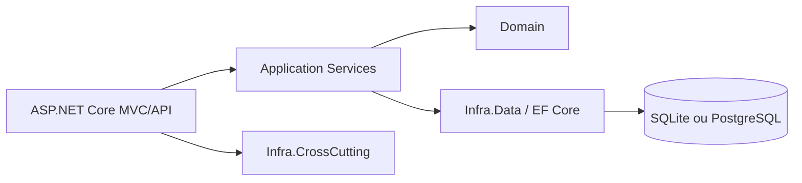
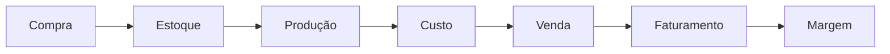

# Órama ERP

ERP industrial desenvolvido em .NET 8 para explorar arquitetura de sistemas corporativos, multi-tenancy, produção, estoque, vendas, financeiro e fiscal. Este é um projeto de portfólio em evolução, não um produto certificado para operação fiscal ou empresarial.

---

## Why this project exists

O repositório demonstra decisões e fluxos típicos de um monólito modular. Funcionalidades fiscais usam um gateway mock e não substituem integração homologada com a SEFAZ.

---

---

## Screenshots

### **Dashboard Executivo**
Screenshots reais ainda não foram capturados. Não há imagens de interface publicadas neste repositório.

### **Gestão de Vendas**

### **App Mobile**
<!-- Add screenshots captured from a running, sanitized instance when available. -->

---

## Highlights

O Órama ERP organiza domínios empresariais em uma solução ASP.NET Core MVC/API e um cliente móvel .NET MAUI.

### **🎯 Principais Características**
- ASP.NET Core MVC e APIs com autenticação JWT
- EF Core com SQLite e PostgreSQL configuráveis
- Vendas, compras, financeiro, estoque, produção/BOM e relatórios
- Fiscal/NF-e isolado, com gateway SEFAZ mock
- Cliente .NET MAUI com persistência local

---

## Architecture

Arquitetura em camadas. Application referencia Infra.Data, portanto o projeto não afirma aderência estrita a Clean Architecture.



O cliente móvel está em `mobile/OramaGo` e usa MVVM, XAML e SQLite local.

---

## Domains

- Cadastros e segurança
- Vendas e compras
- Estoque e inventário
- Produção e estrutura de produto (BOM)
- Financeiro e relatórios
- Fiscal/NF-e: fluxo com gateway mock, sem autorização real pela SEFAZ

## Business flow



## Multi-tenancy

Entidades de negócio carregam `EmpresaId` e as operações devem validar o tenant ativo. A cobertura atual é parcial; consulte [docs/AUDIT.md](docs/AUDIT.md) e [docs/multi-tenancy.md](docs/multi-tenancy.md).

---

## Running locally with Docker

### Clone o repositório
```bash
git clone https://github.com/Lukzera1325/OramaERP.git
cd OramaERP
```

### Configure e suba o ambiente
```bash
cp .env.example .env
# Edite .env: use senhas locais únicas e uma JWT_KEY aleatória (>= 32 caracteres).
docker compose up --build
```

URL: `http://localhost:5000`. Configure `SEED_ADMIN_EMAIL` e `SEED_ADMIN_PASSWORD` no `.env` para provisionar uma conta local, somente se o banco estiver vazio.

O Compose é para desenvolvimento/portfólio. O schema PostgreSQL usa `EnsureCreated`; migrations versionadas ainda são SQLite e não constituem caminho de deploy PostgreSQL.

## Running without Docker

Requires .NET 8 SDK and externally configured `Jwt:Key` (at least 32 characters), `Jwt:Issuer`, `Jwt:Audience` and connection string. Use User Secrets or environment variables; do not store live secrets in appsettings.

### **Backend Web**

#### Local CLI
```bash
dotnet restore Orama.sln
dotnet build Orama.sln --no-restore
dotnet run --project src/Orama.Web
```

### **App Mobile**
```bash
# Abrir no Visual Studio
# Definir mobile/OramaGo como projeto de inicialização
# Executar no emulador ou dispositivo
```

Provision an account individually or use the optional external one-time seed settings. No default login is embedded.

---

## 📚 **DOCUMENTAÇÃO COMPLETA**

### **📖 Para Desenvolvedores**
- **[Documentação Técnica](docs/README.md)** - Visão geral completa
- **[Backend](docs/backend.md)** - Sistema web (.NET 8)
- **[Mobile](docs/mobile.md)** - App mobile (.NET MAUI)
- **[Arquitetura](docs/arquitetura.md)** - Padrões e estrutura

### **👨‍🎓 Para Novos Desenvolvedores**
- **[Guia do Estagiário](docs/guia-estagiario.md)** - Onboarding
- **[Fluxos de Negócio](docs/fluxos-negocio.md)** - Como o sistema funciona

### For DevOps
- [Audit](docs/AUDIT.md)
- [Security review](docs/security-review.md)
- [Docker Compose](docker-compose.yml)

---

## 📈 **ESTATÍSTICAS DO PROJETO**

### Current verification
- Build is tracked through CI; local compile currently retains nullable warnings.
- Automated test scope is described in [docs/AUDIT.md](docs/AUDIT.md).

### **Cobertura Funcional**
- No functionality-completion or production-readiness percentage is claimed.

---

## 🛠️ **TECNOLOGIAS UTILIZADAS**

### **Backend**
- **.NET 8** - Framework principal
- **ASP.NET Core MVC** - Interface web
- **Entity Framework Core** - ORM
- **SQLite/PostgreSQL** - Provedores configuráveis (migrations existentes SQLite)
- **JWT** - Autenticação APIs
- **Bootstrap 5** - Interface responsiva
- **Chart.js** - Gráficos interativos

### **Mobile**
- **.NET MAUI** - Framework multiplataforma
- **SQLite** - Banco local
- **MVVM** - Padrão arquitetural
- **XAML** - Interface nativa

### **DevOps**
- **Docker** - Containerização
- **PowerShell** - Scripts de automação
- **Git** - Controle de versão

---

## 🎯 **PRÓXIMOS PASSOS**

### **Curto Prazo (1-2 semanas)**
1. **Exportação Excel/PDF** - Integrar bibliotecas
2. **Testes de produção** - Validação completa
3. **Documentação usuário** - Manual completo

### **Médio Prazo (1-2 meses)**
4. **Integração SEFAZ** - Notas fiscais eletrônicas
5. **Business Intelligence** - Dashboards avançados
6. **Performance** - Otimizações e cache

### **Longo Prazo (3-6 meses)**
7. **Integrações externas** - Bancos, contabilidade
8. **Módulos específicos** - Por setor/nicho
9. **Marketplace** - Extensões e plugins

---

## 🏆 **CONQUISTAS**

### Escopo
- Monólito modular em evolução
- Isolamento de tenant requer validação e testes contínuos

### Estado
- Não declarar funcionalidades como completas sem testes/validação específicos.

### Limitações
- Projeto de portfólio, não certificado para produção empresarial ou emissão fiscal real.

---

## 📞 **SUPORTE E CONTATO**

### **Documentação Técnica**
- Consulte os arquivos .md específicos
- Código comentado e documentado
- Exemplos de uso incluídos

### **Desenvolvimento**
- Arquitetura modular e extensível
- Padrões DDD implementados
- Testes automatizados iniciais; confira o audit para o escopo e limitações.

---

## 🎊 **CONCLUSÃO**

O Órama ERP é um projeto de portfólio. A entrada em produção depende de auditorias, testes e operação de infraestrutura que ainda não foram verificados.

---

**Desenvolvido com ❤️ em .NET 8**  
**Última atualização**: 2026
